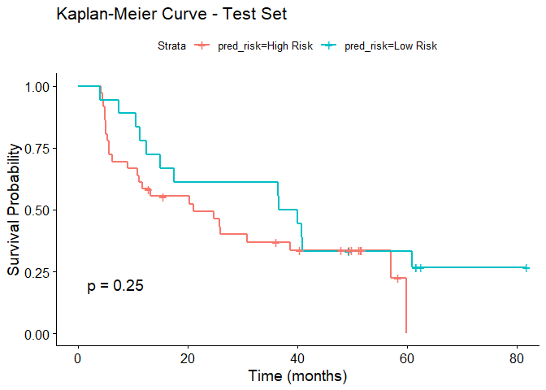
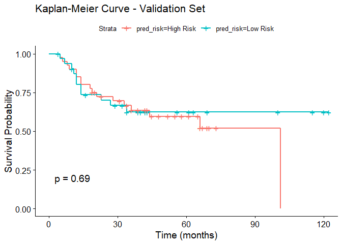

Stratification Model
================
Kevin Zhang
2025-03-27

``` r
# Load libraries
library(tidyverse)
library(caret)
library(limma)
library(glmnet)
library(pROC)
library(survival)
library(survminer)
```

### Load Datasets

``` r
# Load data
uromol_data <- readRDS("UROMOL_TaLG.teachingcohort.rds")

knowles_data <- readRDS("knowles_matched_TaLG_final.rds")
```

### Process UROMOL Training Set and Split Into Training and Test Sets

``` r
# Remove patients with missing Recurrence labels
filtered_data <- uromol_data %>% filter(!is.na(Recurrence) & !is.na(Age))

# Create train/test split (80% train, 20% test)
set.seed(9999)
train_index <- createDataPartition(filtered_data$Recurrence, p = 0.8, list = FALSE)

# Split dataset
train_data <- filtered_data[train_index, ]
test_data <- filtered_data[-train_index, ]

# Extract target labels
train_y <- as.factor(filtered_data$Recurrence)[train_index]
test_y <- as.factor(filtered_data$Recurrence)[-train_index]

# Split clinical data
train_clinical <- filtered_data[train_index, 1:17] %>% select(-c(Recurrence, UROMOL.ID, Progression, PFS_time., RFS_time, FUtime_days., Smoking, Tumor.stage, Tumor.grade, Concomitant.CIS, Tumor.size, Incident.tumor, EAU.risk, UROMOL2021.classification))

test_clinical <- filtered_data[-train_index, 1:17] %>% select(-c(Recurrence, UROMOL.ID, Progression, PFS_time., RFS_time, FUtime_days., Smoking, Tumor.stage, Tumor.grade, Concomitant.CIS, Tumor.size, Incident.tumor, EAU.risk, UROMOL2021.classification))

# Split gene expression matrix
train_exprs <- filtered_data[train_index, 18:ncol(filtered_data)]
test_exprs <- filtered_data[-train_index, 18:ncol(filtered_data)]

# Combine clinical and gene expression data
train_x <- cbind(train_clinical, train_exprs)
test_x <- cbind(test_clinical, test_exprs)
```

### Process Knowles Validation Set

``` r
# Remove patients with missing recurrence labels
valid_filtered_data <- knowles_data %>% filter(!is.na(Recurrence))

# Impute NA values in RFS_time based on FUtime for non-recurrence patients
valid_filtered_data$RFS_time <- ifelse(
  is.na(valid_filtered_data$RFS_time) & valid_filtered_data$Recurrence == 0, 
  valid_filtered_data$FUtime_days / 30, 
  valid_filtered_data$RFS_time
)


# Extract clinical metadata
valid_clinical <- valid_filtered_data[, 1:12] %>% select(-c(Recurrence, Progression, PFS_time., RFS_time, FUtime_days., Tumor.stage, Tumor.grade, Concomitant.CIS, UROMOL2021.classification))

# Extract recurrence labels and remove it from inputs
valid_y <- as.factor(valid_filtered_data$Recurrence)

# Normalize Microarray gene expression data
valid_exprs <- as.matrix(valid_filtered_data[, 13:ncol(valid_filtered_data)])
colnames(valid_exprs) <- sub("^exprs\\.", "", colnames(valid_exprs))

# Combine clinical and expression data
valid_x <- cbind(valid_clinical, valid_exprs)
```

### Select Features by Differential Expression Between Recurrence Statuses

``` r
# Feature selection based on DEGs for recurrence status

# Create a design matrix for recurrence status
design <- model.matrix(~ train_y)

# Fit limma model
set.seed(9999)
fit <- lmFit(t(train_exprs), design)
fit <- eBayes(fit)

# Select top differentially expressed genes
top_genes <- rownames(topTable(fit, coef = 2, n = 5000, p.value = 0.1))
train_exprs_filtered <- train_exprs[, colnames(train_exprs) %in% top_genes]
```

### Create and Train Elastic Net Model Using Selected Genes and Clinical Variables

``` r
# Train Elastic Net Model

# Convert labels to numeric
y_numeric <- as.numeric(as.character(train_y))

# Fit Elastic Net model
set.seed(9999)
cv_model <- cv.glmnet(
  x = as.matrix(train_exprs_filtered),
  y = y_numeric,
  alpha = 0.5,  # Elastic Net (alpha = 0.5)
  family = "binomial"  # For binary classification
)

# Extract selected genes (nonzero coefficients)
selected_genes <- coef(cv_model, s = "lambda.min")[-1, , drop = FALSE]
selected_genes <- colnames(train_exprs_filtered)[which(selected_genes != 0)]

# Filter selected genes that are common to training, test, and validation sets
common_genes <- intersect(selected_genes, colnames(valid_exprs))

# Train final model on selected features
final_train_x <- cbind(train_clinical, train_exprs_filtered[, common_genes])

# Fit final Elastic Net
final_model <- glmnet(as.matrix(final_train_x), y_numeric, alpha = 0.5)
```

    ## Warning in storage.mode(xd) <- "double": NAs introduced by coercion

### Test Model Performance on Test Set (Internal Validation)

``` r
# Testing model on test set

# Prepare the test set 
test_exprs_filtered <- test_exprs[, common_genes]
final_test_x <- cbind(test_clinical, test_exprs_filtered)

# Make predictions
set.seed(9999)
pred_labels <- predict(final_model, as.matrix(final_test_x), type = "class", s = cv_model$lambda.min)
```

    ## Warning in cbind2(1, newx) %*% nbeta: NAs introduced by coercion

``` r
pred_labels <- ifelse(pred_labels > 0.5, 1, 0) %>%
  factor(levels = levels(test_y))

# Evaluate the model (Confusion Matrix)
confusion_matrix <- confusionMatrix(pred_labels, test_y)
print(confusion_matrix)
```

    ## Confusion Matrix and Statistics
    ## 
    ##           Reference
    ## Prediction  0  1
    ##          0  5 13
    ##          1 11 25
    ##                                          
    ##                Accuracy : 0.5556         
    ##                  95% CI : (0.414, 0.6908)
    ##     No Information Rate : 0.7037         
    ##     P-Value [Acc > NIR] : 0.9929         
    ##                                          
    ##                   Kappa : -0.0286        
    ##                                          
    ##  Mcnemar's Test P-Value : 0.8383         
    ##                                          
    ##             Sensitivity : 0.31250        
    ##             Specificity : 0.65789        
    ##          Pos Pred Value : 0.27778        
    ##          Neg Pred Value : 0.69444        
    ##              Prevalence : 0.29630        
    ##          Detection Rate : 0.09259        
    ##    Detection Prevalence : 0.33333        
    ##       Balanced Accuracy : 0.48520        
    ##                                          
    ##        'Positive' Class : 0              
    ## 

``` r
# Calculate Accuracy
accuracy <- sum(pred_labels == test_y) / length(test_y)
print(paste("Accuracy: ", accuracy))
```

    ## [1] "Accuracy:  0.555555555555556"

``` r
# Calculate AUC
set.seed(9999)
pred_probs <- predict(final_model, as.matrix(final_test_x), type = "response", s = cv_model$lambda.min)
```

    ## Warning in cbind2(1, newx) %*% nbeta: NAs introduced by coercion

``` r
roc_curve <- roc(test_y, pred_probs)
```

    ## Setting levels: control = 0, case = 1

    ## Warning in roc.default(test_y, pred_probs): Deprecated use a matrix as
    ## predictor. Unexpected results may be produced, please pass a numeric vector.

    ## Setting direction: controls < cases

``` r
print(paste("AUC: ", auc(roc_curve)))
```

    ## [1] "AUC:  0.578947368421053"

### Test Model Performance on Validation Set (External Validation)

``` r
# Testing model on validation set

# Prepare the validation set
valid_exprs_filtered <- valid_exprs[, common_genes, drop = FALSE]
final_valid_x <- cbind(valid_clinical, valid_exprs_filtered)

# Make predictions
set.seed(9999)
valid_pred_labels <- predict(final_model, as.matrix(final_valid_x), type = "class", s = cv_model$lambda.min)
```

    ## Warning in cbind2(1, newx) %*% nbeta: NAs introduced by coercion

``` r
valid_pred_labels <- ifelse(valid_pred_labels > 0.5, 1, 0) %>%
  factor(levels = levels(valid_y))

# Evaluate the model (Confusion Matrix)
valid_confusion_matrix <- confusionMatrix(valid_pred_labels, valid_y)
print(valid_confusion_matrix)
```

    ## Confusion Matrix and Statistics
    ## 
    ##           Reference
    ## Prediction  0  1
    ##          0 21 11
    ##          1 23 18
    ##                                          
    ##                Accuracy : 0.5342         
    ##                  95% CI : (0.4137, 0.652)
    ##     No Information Rate : 0.6027         
    ##     P-Value [Acc > NIR] : 0.90504        
    ##                                          
    ##                   Kappa : 0.0915         
    ##                                          
    ##  Mcnemar's Test P-Value : 0.05923        
    ##                                          
    ##             Sensitivity : 0.4773         
    ##             Specificity : 0.6207         
    ##          Pos Pred Value : 0.6562         
    ##          Neg Pred Value : 0.4390         
    ##              Prevalence : 0.6027         
    ##          Detection Rate : 0.2877         
    ##    Detection Prevalence : 0.4384         
    ##       Balanced Accuracy : 0.5490         
    ##                                          
    ##        'Positive' Class : 0              
    ## 

``` r
# Calculate Accuracy
valid_accuracy <- sum(valid_pred_labels == valid_y) / length(valid_y)
print(paste("Accuracy: ", valid_accuracy))
```

    ## [1] "Accuracy:  0.534246575342466"

``` r
# Calculate AUC (if needed)
set.seed(9999)
valid_pred_probs <- predict(final_model, as.matrix(final_valid_x), type = "response", s = cv_model$lambda.min)
```

    ## Warning in cbind2(1, newx) %*% nbeta: NAs introduced by coercion

``` r
valid_roc_curve <- roc(valid_y, valid_pred_probs)
```

    ## Setting levels: control = 0, case = 1

    ## Warning in roc.default(valid_y, valid_pred_probs): Deprecated use a matrix as
    ## predictor. Unexpected results may be produced, please pass a numeric vector.

    ## Setting direction: controls < cases

``` r
print(paste("AUC: ", auc(valid_roc_curve)))
```

    ## [1] "AUC:  0.538401253918495"

### Kaplan-Meier Survival Curves Based on Stratification by Model

``` r
# Kaplan-Meier Survival Analysis

# RFS for test set
test_surv <- Surv(time = test_data$RFS_time, event = test_data$Recurrence)

# RFS for validation set
valid_surv <- Surv(time = valid_filtered_data$RFS_time, event = valid_filtered_data$Recurrence)

# Create data frame with predicted risk groups and survival data for test set
test_data$pred_risk <- factor(pred_labels, levels = c(0, 1), labels = c("Low Risk", "High Risk"))

# Fit Kaplan-Meier model for the test set
test_km_fit <- survfit(test_surv ~ test_data$pred_risk)


# Create a data frame with predicted risk groups and survival data for validation set
valid_filtered_data$pred_risk <- factor(valid_pred_labels, levels = c(0, 1), labels = c("Low Risk", "High Risk"))

# Fit Kaplan-Meier model for the validation set
valid_km_fit <- survfit(valid_surv ~ valid_filtered_data$pred_risk)


# Plot Kaplan-Meier curve for test set
(test_km_plot <- ggsurvplot(test_km_fit, data = test_data, pval = TRUE, risk.table = FALSE, 
                           title = "Kaplan-Meier Curve - Test Set", 
                           xlab = "Time (months)", ylab = "Survival Probability"))
```

<!-- -->

``` r
# Plot Kaplan-Meier curve for validation set
(valid_km_plot <- ggsurvplot(valid_km_fit, data = valid_filtered_data, pval = TRUE, risk.table = FALSE,
                            title = "Kaplan-Meier Curve - Validation Set", 
                            xlab = "Time (months)", ylab = "Survival Probability"))
```

<!-- -->

### Prediction Output Files

``` r
# Write confusion matrix, accuracy, and AUC for test set
writeLines(c(capture.output(print(confusion_matrix)), paste("Accuracy: ", accuracy), paste("AUC: ", auc(roc_curve))), "test_metrics.txt")

# Write confusion matrix, accuracy, and AUC for validation set
writeLines(c(capture.output(print(valid_confusion_matrix)), paste("Accuracy: ", valid_accuracy), paste("AUC: ", auc(valid_roc_curve))), "validation_metrics.txt")

# Create test set prediction table
test_predictions <- test_data[, c("UROMOL.ID", "Recurrence", "RFS_time", "pred_risk")]

# Create validation set prediction table
valid_predictions <- valid_filtered_data[, c("Recurrence", "RFS_time", "pred_risk")]
valid_predictions <- cbind(Knowles_ID = rownames(valid_filtered_data), valid_predictions)

# Write to csv files
write.csv(test_predictions, file = "UROMOL_test_predictions.csv")
write.csv(valid_predictions, file = "Knowles_validation_predicitons.csv")

# Save Kaplan-Meier curves
svg("KaplanMeier_Test.svg", width = 8, height = 6)
print(test_km_plot)
dev.off()

svg("KaplanMeier_Validation.svg", width = 8, height = 6)
print(valid_km_plot)
dev.off()
```
